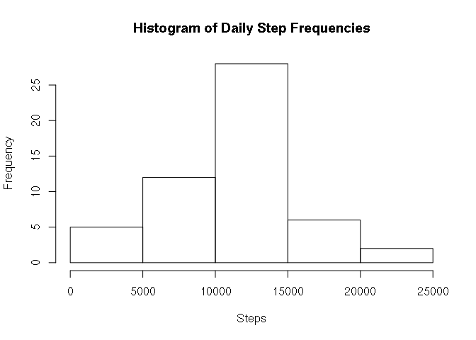
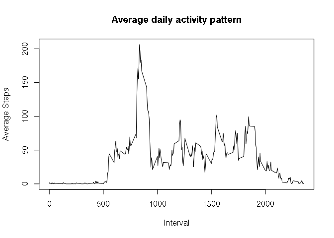
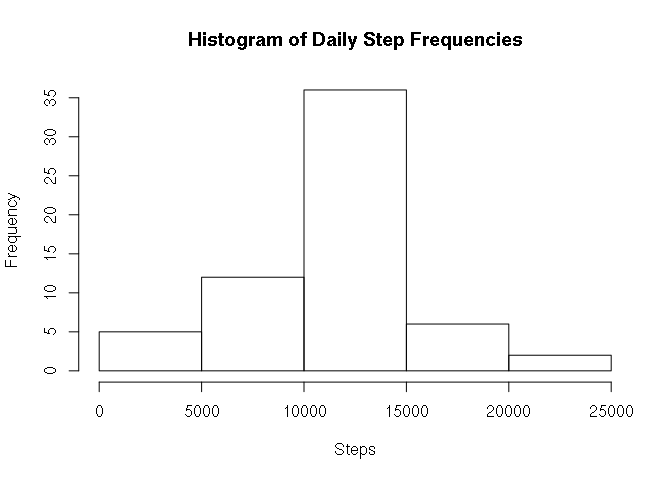
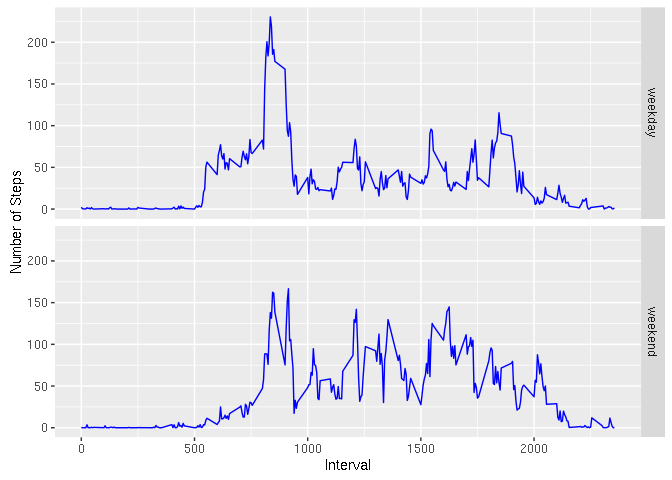

# Reproducible Research: Peer Assessment 1


## Loading and preprocessing the data

The data is read into a variable named activity. The atomic class of each column is specified.


```r
activity <- read.csv("activity.csv", colClasses = c("integer", "Date", "integer"))
```

## What is mean total number of steps taken per day?

The dplyr packaged is loaded. The total number of steps taken per day are calculated and stored 
as variable, totalsteps. The histogram below shows the frequency of total steps per day.


```r
library(dplyr)
totalsteps <- summarize(group_by(activity, date), sum(steps))
hist(totalsteps$`sum(steps)`, main = "Histogram of Daily Step Frequencies", xlab = "Steps")
```

<!-- -->

```r
averagesteps <- mean(totalsteps$`sum(steps)`, na.rm = TRUE)
mediansteps <- median(totalsteps$`sum(steps)`, na.rm = TRUE)
```

The mean total number of steps taken per day is 1.0766189\times 10^{4}.
The median total number of steps taken per day is 10765.

## What is the average daily activity pattern?

The number of steps within a given interval is averaged across all days and these results
are stored in the variable, intervalmean.
The plot below displays the average daily activity pattern.


```r
intervalmean <- summarize(group_by(activity,interval), mean(steps, na.rm = TRUE))
plot(intervalmean$interval, intervalmean$`mean(steps, na.rm = TRUE)`, type = "l", 
     xlab = "Interval", ylab = "Average Steps", main = "Average daily activity pattern")
```

<!-- -->

```r
indexmax <- which.max(intervalmean$`mean(steps, na.rm = TRUE)`)
maxmean <- intervalmean$`mean(steps, na.rm = TRUE)`[indexmax]
maxinterval <- intervalmean$interval[indexmax]
```

The interval, 835, is the 5-minute interval that contains the maximum number of 
steps with a value of 206.1698113 averaged across all the days in the dataset.

## Imputing missing values

Missing values are imputed by estimating them to be the number of steps taken during that
interval averaged over all days of the dataset. A new activity data set is built this way 
and stored in variable, noNA. The histogram below shows the total number of steps taken each day
after imputing missing values.


```r
numberNA <- sum(is.na(activity$steps))
noNA <- activity
for (i in 1:length(activity$steps)) {
    if (is.na(activity$steps[i])) {
        intervalNA <- activity$interval[i]
        noNA$steps[i] <- 
            intervalmean$`mean(steps, na.rm = TRUE)`[which(intervalmean$interval == intervalNA)]
    }
}
newtotalsteps <- summarize(group_by(noNA, date), sum(steps))
hist(newtotalsteps$`sum(steps)`, main = "Histogram of Daily Step Frequencies", 
     xlab = "Steps")
```

<!-- -->

```r
newaveragesteps <- mean(newtotalsteps$`sum(steps)`)
newmediansteps <- median(newtotalsteps$`sum(steps)`)
meandiff <- abs(averagesteps - newaveragesteps)
mediandiff <- abs(mediansteps - newmediansteps)
```

The total number of missing values in the dataset is 2304.
When the NAs are removed by imputing missing data,
the new mean total number of steps taken per day is 1.0766189\times 10^{4} and
the new median total number of steps taken per day is 1.0766189\times 10^{4}.
These values differ from the original dataset by 0 and 1.1886792
in mean and median total number of steps respectively.

## Are there differences in activity patterns between weekdays and weekends?
A new factor variable is added to the noNA data frame with two levels – “weekday” and “weekend” 
indicating whether a given date is a weekday or weekend day.
The number of steps taken for a given interval is averaged across weekdays and weekends and 
stored in the variable, dayaveraged.

```r
noNA$day <- as.factor(weekdays(noNA$date))
noNA$day <- recode(noNA$day, "Saturday" = "weekend", "Sunday" = "weekend", 
                   "Monday" = "weekday", "Tuesday" = "weekday", "Wednesday" = "weekday", 
                   "Thursday" = "weekday", "Friday" = "weekday")
dayaveraged <- summarize(group_by(noNA,day,interval), mean(steps))
library(ggplot2)
ggplot(dayaveraged, aes(interval, `mean(steps)`)) + facet_grid(day ~.) + 
    geom_line(color = "blue") + ylab("Number of Steps") + xlab("Interval")
```

<!-- -->

The figure above shows the differences in the average daily activity patterns for weekdays and weekends.
